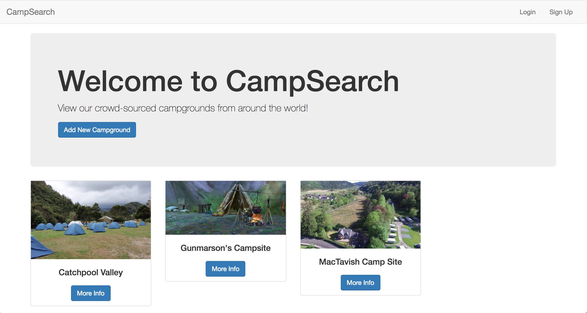
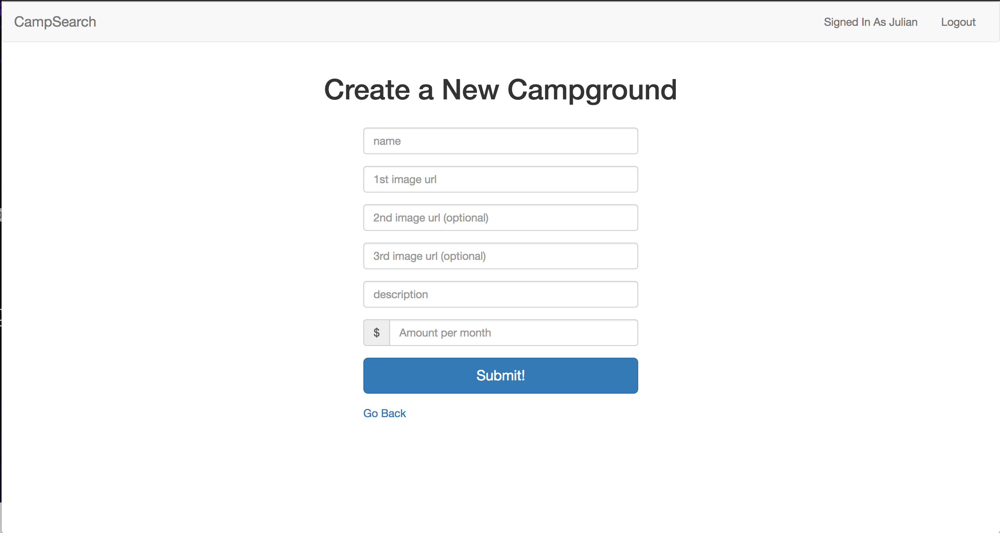

# CampSearch
Public sandbox for users to create accounts, upload campgrounds, edit their posts, and comment on posts

### Libraries used:
+ MongoDB for persistent storage
+ Mongoose for MongoDB object modeling
+ Bluebird for Promises since built in Mongoose promises were recently deprecated
+ Express for API routing 
+ Express Session to manage user sessions
+ Express Validator to validate user inputs
+ Method Override so we have access to DELETE/UPDATE CRUD functions
+ Passport/Passport Local/Passport-Local Mongoose for node.js middleware authentication
+ EJS for Javascript templating within HTML
+ Connect Flash to display flash middleware messages to the user after various api calls

